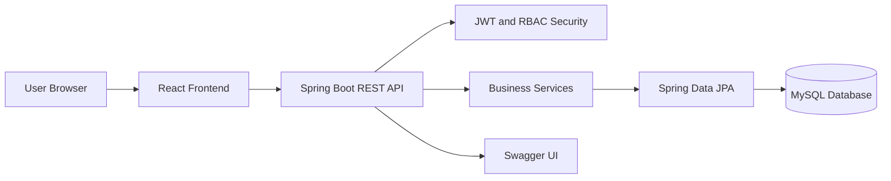
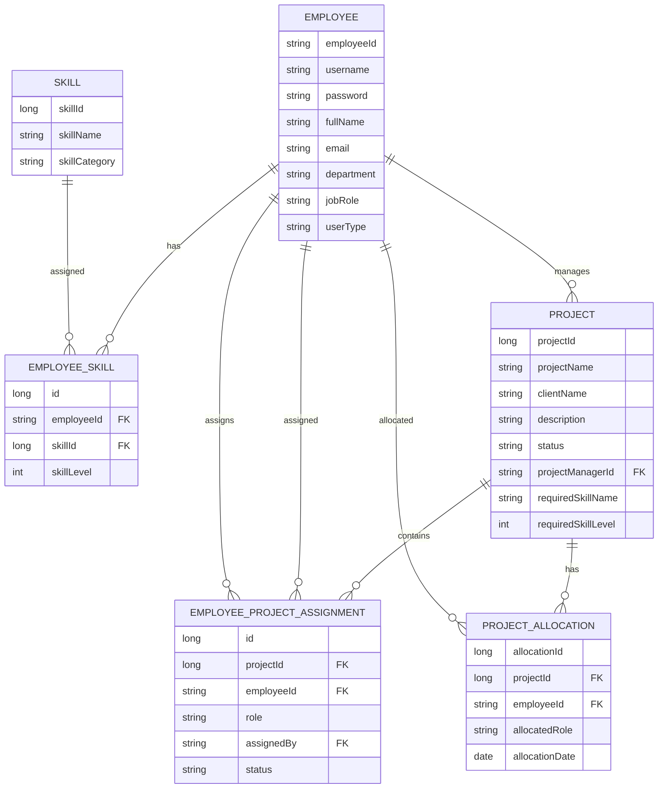

# SoftBridge Resource Allocation System (SRAS)

Demo Video: https://youtu.be/5o-Ygznk_8o

SoftBridge Resource Allocation System (SRAS) is a full-stack enterprise resource allocation platform for managing employees, skills, projects, project managers, and project team assignments.

The system is designed for HR teams and Project Managers to allocate employees to projects based on availability, roles, and skill levels while keeping employee access limited to their own profile, skills, and assigned project information.

## Project Overview

SRAS provides a role-based workflow for project staffing inside an organization.

The system supports three user roles:

- HR
- PM
- EMPLOYEE

HR can manage employees, skills, projects, and assign Project Managers to projects. Project Managers can view only their assigned projects, search qualified employees, assign team members to project roles, update project status, and manage project teams. Employees can manage their own profile and skills while viewing only assigned project details.

## Key Features

- JWT-based authentication
- Role-based access control
- HR dashboard
- Project Manager dashboard
- Employee dashboard
- Employee CRUD management
- Global skill management
- Employee skill self-service
- Project creation and management
- PM assignment by HR
- PM availability handling
- Skill-based employee search
- Manual employee assignment to project roles
- Project status updates by assigned PM
- Project team visibility for HR and PM
- Assigned project visibility for employees
- Swagger API documentation
- Demo data seeding
- Global exception handling

## User Roles

### HR

HR users can:

- View all employees
- Add, update, and delete employees
- Manage skills
- Create projects
- Assign Project Managers to projects
- View project teams
- Delete projects

### Project Manager

Project Managers can:

- View only assigned projects
- Search employees by skill and level
- Assign employees to project roles
- View project team members
- Remove assigned employees from project teams
- Update project status
- Complete project teams

### Employee

Employees can:

- View only their own profile
- Update their own profile
- Add, update, and delete their own skills
- View assigned project details
- View assigned project status

## Tech Stack

| Layer | Technology |
| --- | --- |
| Backend | Java 17, Spring Boot |
| Security | Spring Security, JWT, BCrypt |
| Data | Spring Data JPA, Hibernate, MySQL |
| Validation | Jakarta Validation |
| API Docs | Swagger / OpenAPI |
| Build | Gradle |
| Frontend | React, Vite, JavaScript |
| Routing | React Router |
| HTTP Client | Axios |
| Styling | CSS |

## System Architecture

This is the current high-level runtime architecture.



## ER Diagram

This ERD reflects the current JPA entity model. The `Project.projectManager` relation is modeled as many projects to one employee at the database level, while the service layer enforces the business rule that one PM can only be assigned to one active project.



## Main Modules

### Authentication Module

- Login using username and password
- Passwords stored using BCrypt
- JWT token generated after successful login
- Role and employee ID returned to frontend
- JWT includes authenticated user role

### Employee Module

- Create employee
- View employees
- Update employee
- Delete employee
- Role-based access control applied at backend level

### Skill Module

- HR manages global skills
- Employees manage their own skills
- Skills are used for qualified employee search and assignment validation

### Project Module

- HR creates projects
- HR assigns one PM per project
- PM can access only assigned projects
- PM can update project status
- HR can view all projects

### Project Team Module

- PM searches employees by skill and level
- PM manually assigns employees by username or employee ID
- PM assigns employees to project roles
- PM can remove assigned employees from the project team
- Employees can view assigned project and role

## API Documentation

Swagger UI is available locally at:

```text
http://localhost:8081/swagger-ui/index.html
```

## Important API Endpoints

### Authentication

| Method | Endpoint | Access |
| --- | --- | --- |
| POST | `/auth/login` | Public |

### Employees

| Method | Endpoint | Access |
| --- | --- | --- |
| GET | `/employees` | HR |
| POST | `/employees` | HR |
| GET | `/employees/{id}` | HR, own employee |
| PUT | `/employees/{id}` | HR, own employee |
| DELETE | `/employees/{id}` | HR |
| GET | `/employees/availability` | HR, PM |
| GET | `/employees/available` | HR, PM |

### Skills

| Method | Endpoint | Access |
| --- | --- | --- |
| GET | `/skills` | HR |
| POST | `/skills` | HR |
| PUT | `/skills/{id}` | HR |
| DELETE | `/skills/{id}` | HR |
| GET | `/skills/me` | EMPLOYEE |
| POST | `/skills/me` | EMPLOYEE |
| PUT | `/skills/me/{id}` | EMPLOYEE |
| DELETE | `/skills/me/{id}` | EMPLOYEE |
| GET | `/employee-skills/employees/search` | HR, PM |

### Projects

| Method | Endpoint | Access |
| --- | --- | --- |
| GET | `/projects` | HR |
| POST | `/projects` | HR |
| DELETE | `/projects/{id}` | HR |
| PUT | `/projects/{id}/pm` | HR |
| GET | `/projects/my` | PM |
| PUT | `/projects/my/{id}/status` | assigned PM |
| GET | `/projects/employee` | EMPLOYEE |
| POST | `/projects/{projectId}/assign/{employeeId}` | PM, HR |
| GET | `/projects/{projectId}/team` | PM, HR |
| DELETE | `/projects/my/{projectId}/team/{assignmentId}` | assigned PM |
| DELETE | `/projects/{projectId}/team/{assignmentId}` | PM, HR |
| PUT | `/projects/{projectId}/complete` | assigned PM |
| PUT | `/projects/{projectId}/change-team` | assigned PM |

### Project Managers

| Method | Endpoint | Access |
| --- | --- | --- |
| GET | `/pms` | HR |

## Local Setup

### Backend Setup

Clone the repository:

```bash
git clone https://github.com/your-username/your-repository-name.git
cd your-repository-name
```

Configure MySQL database in:

```text
src/main/resources/application.properties
```

Example:

```properties
spring.datasource.url=jdbc:mysql://localhost:3306/softbridge
spring.datasource.username=root
spring.datasource.password=your_password
```

Run backend:

```bash
./gradlew bootRun
```

For Windows:

```bash
.\gradlew bootRun
```

Backend runs on:

```text
http://localhost:8081
```

### Frontend Setup

Go to the frontend folder:

```bash
cd frontend
```

Install dependencies:

```bash
npm install
```

Run frontend:

```bash
npm run dev
```

Frontend runs on:

```text
http://localhost:5173
```

## Demo Login Credentials

Seeded demo users use this password:

```text
SoftBridge@123
```

Example HR user:

```text
Username: sameera0091
```

Example Project Manager user:

```text
Username: use a seeded PM username from the employee list
```

Example Employee user:

```text
Username: john0001
```

## Deployment Notes

## Deployment Architecture

- Frontend: Vercel
- Backend: Koyeb
- Database: MySQL

The system is designed to be deployed using Vercel for the React frontend and Koyeb for the Spring Boot backend, providing a lightweight cloud deployment setup for full-stack applications.

- Configure production database credentials.
- Configure production frontend API base URL.
- Configure CORS for the deployed frontend origin.
- Use a strong JWT secret in production.
- Rebuild the frontend after changing the API URL.
- Restart the backend after deployment.

## Future Enhancements

- Email notifications
- Pagination and sorting
- Audit logs
- Advanced dashboard analytics
- Automated integration tests
- Refresh tokens
- Deployment pipeline automation

## Author

Developed by Upuli Kuruppu
