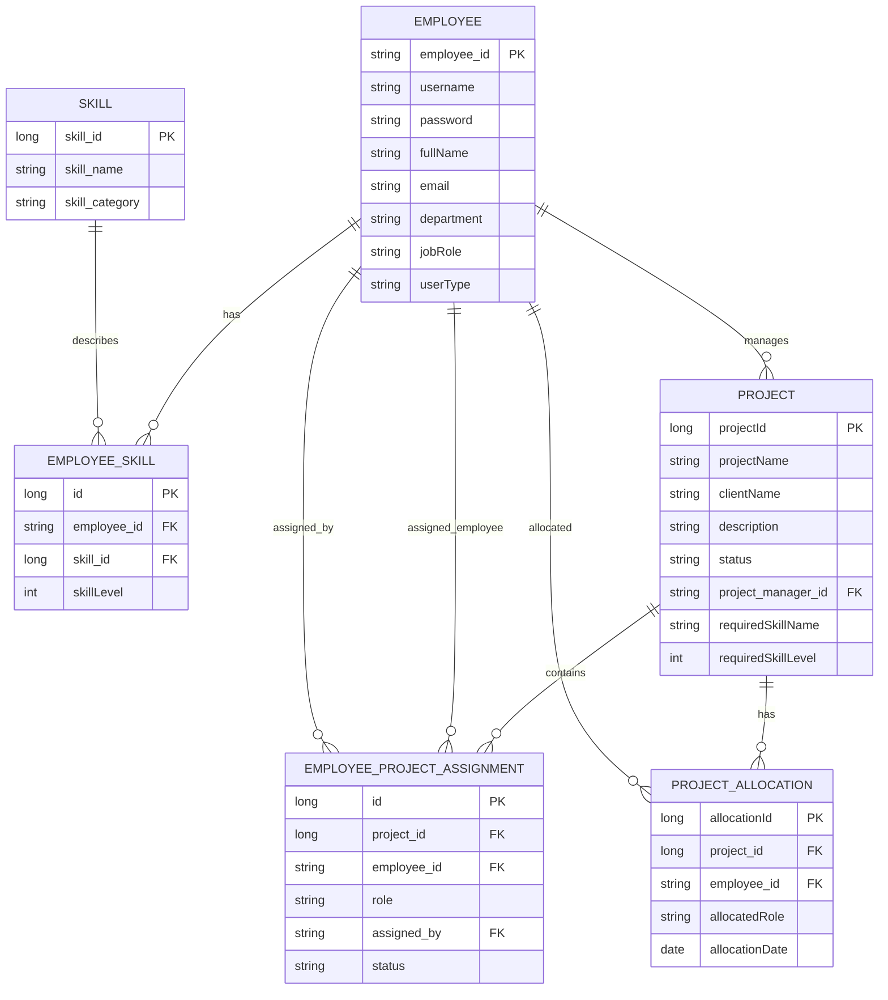

# ER Diagram

This ERD is generated from the current JPA entities in `src/main/java/com/softbridge/sras/model`.

The `Project.projectManager` relationship is stored as a many-to-one foreign key to `Employee`. The service layer enforces the business rule that one PM can only be assigned to one project.

