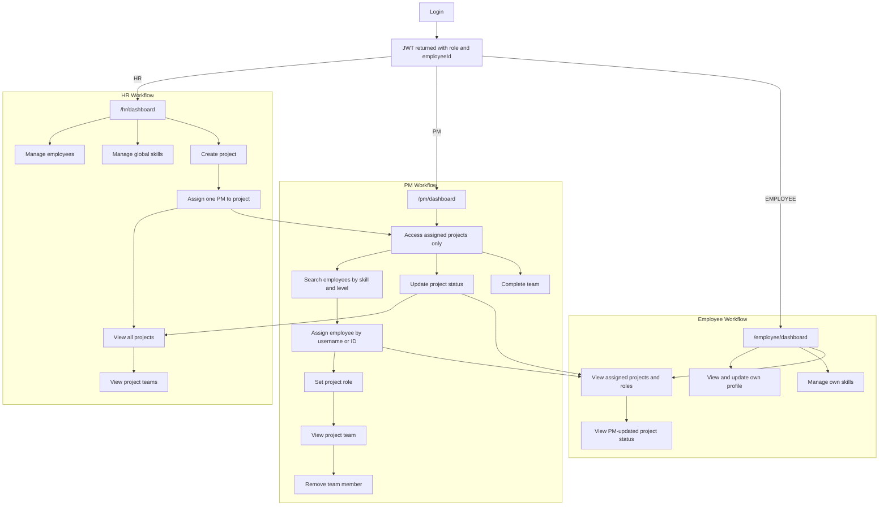

# Role Interaction Diagram

This diagram reflects the implemented RBAC workflow and the frontend role routes.

```mermaid
flowchart TB
    Login["Login"]
    JWT["JWT returned with role and employeeId"]
    HRDash["/hr/dashboard"]
    PMDash["/pm/dashboard"]
    EmployeeDash["/employee/dashboard"]

    Login --> JWT
    JWT -->|HR| HRDash
    JWT -->|PM| PMDash
    JWT -->|EMPLOYEE| EmployeeDash

    subgraph HR["HR Workflow"]
        HRDash --> ManageEmployees["Manage employees"]
        HRDash --> ManageSkills["Manage global skills"]
        HRDash --> CreateProject["Create project"]
        CreateProject --> AssignPM["Assign one PM to project"]
        AssignPM --> ViewAllProjects["View all projects"]
        ViewAllProjects --> ViewTeams["View project teams"]
    end

    subgraph PM["PM Workflow"]
        PMDash --> AssignedProjects["Access assigned projects only"]
        AssignedProjects --> ReviewSkills["Search employees by skill and level"]
        ReviewSkills --> ManualAssign["Assign employee by username or ID"]
        ManualAssign --> ProjectRole["Set project role"]
        ProjectRole --> TeamTable["View project team"]
        TeamTable --> RemoveMember["Remove team member"]
        AssignedProjects --> UpdateStatus["Update project status"]
        AssignedProjects --> CompleteTeam["Complete team"]
    end

    subgraph EMPLOYEE["Employee Workflow"]
        EmployeeDash --> OwnProfile["View and update own profile"]
        EmployeeDash --> OwnSkills["Manage own skills"]
        EmployeeDash --> AssignedProjectView["View assigned projects and roles"]
        AssignedProjectView --> ProjectStatus["View PM-updated project status"]
    end

    AssignPM --> AssignedProjects
    ManualAssign --> AssignedProjectView
    UpdateStatus --> ViewAllProjects
    UpdateStatus --> AssignedProjectView
```
