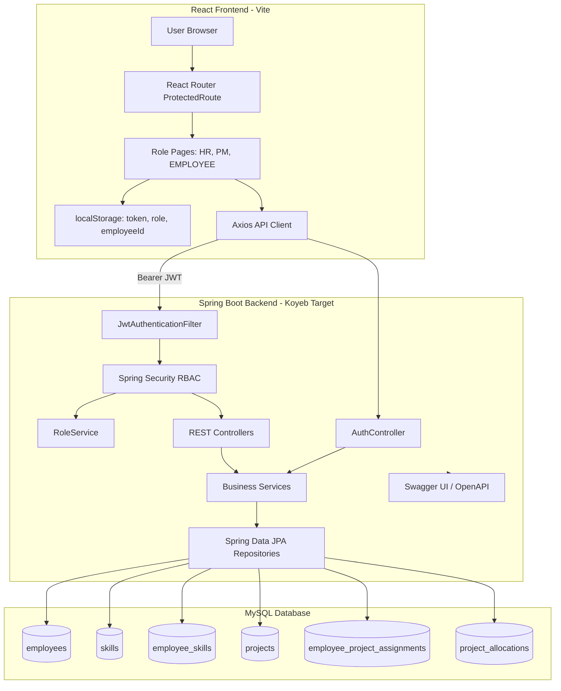
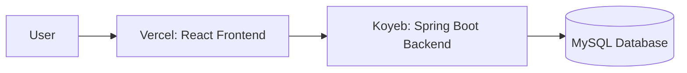

# High-Level System Architecture

This diagram reflects the current Spring Boot and React implementation.

```mermaid
flowchart TB
    subgraph Client["React Frontend - Vite"]
        Browser["User Browser"]
        Router["React Router ProtectedRoute"]
        Pages["Role Pages: HR, PM, EMPLOYEE"]
        AuthStore["localStorage: token, role, employeeId"]
        Axios["Axios API Client"]
    end

    subgraph Backend["Spring Boot Backend - Koyeb Target"]
        AuthController["AuthController"]
        Controllers["REST Controllers"]
        JwtFilter["JwtAuthenticationFilter"]
        Security["Spring Security RBAC"]
        RoleService["RoleService"]
        Services["Business Services"]
        Repositories["Spring Data JPA Repositories"]
        Swagger["Swagger UI / OpenAPI"]
    end

    subgraph Database["MySQL Database"]
        Employees[("employees")]
        Skills[("skills")]
        EmployeeSkills[("employee_skills")]
        Projects[("projects")]
        Assignments[("employee_project_assignments")]
        Allocations[("project_allocations")]
    end

    Browser --> Router
    Router --> Pages
    Pages --> AuthStore
    Pages --> Axios
    Axios -->|Bearer JWT| JwtFilter
    Axios --> AuthController
    JwtFilter --> Security
    Security --> RoleService
    Security --> Controllers
    Controllers --> Services
    Services --> Repositories
    Repositories --> Employees
    Repositories --> Skills
    Repositories --> EmployeeSkills
    Repositories --> Projects
    Repositories --> Assignments
    Repositories --> Allocations
    AuthController --> Services
    Backend --> Swagger
```

## Deployment Target

```mermaid
flowchart LR
    User["User"] --> Vercel["Vercel: React Frontend"]
    Vercel --> Koyeb["Koyeb: Spring Boot Backend"]
    Koyeb --> MySQL[("MySQL Database")]
```
